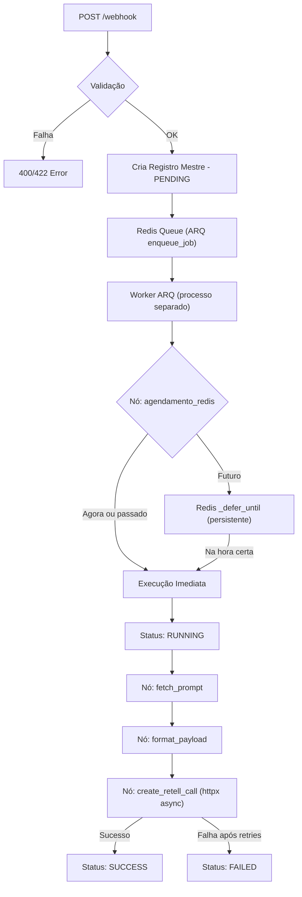

# Project Architecture - AI Agent Guide

Este documento serve como guia técnico para agentes de IA que operam neste repositório. Ele detalha a estrutura, o fluxo de dados e os padrões de design adotados.

## 🏛️ Visão Geral

O projeto é um sistema **Event-Driven Workflow (EDW)** focado na migração e integração de processos de automação. Ele utiliza uma arquitetura baseada em microsserviços leves com FastAPI, filas persistentes via **Redis + ARQ** (Async Redis Queue), I/O assíncrono com **httpx**, e delegação de estado para o Supabase.

O workflow ativo (`pre_call_processing`) recebe solicitações via webhook, busca prompts dinâmicos no Supabase, formata variáveis de contexto, e dispara chamadas telefônicas via Retell AI.

## 📂 Estrutura de Repositório

```text
Migracao/
├── .agents/                 # Inteligência do Agente
│   ├── skills/              # Skills específicas (documentador-n8n, mcp-builder, skill-creator, supabase-postgres-best-practices)
│   ├── workflows/           # Definições de fluxos de agentes
│   └── System_prompt.md     # Persona e regras de comportamento do agente
├── docs/                    # Documentação técnica
│   ├── architecture.md      # Guia para agentes (este arquivo)
│   ├── conventions.md       # Convenções de código e padrões EDW
│   ├── workflow.md          # Definição do workflow pre_call_processing
│   ├── workflow-retell-call.md         # Documentação do fluxo n8n original (referência de migração)
│   └── workflow-retell-integration.md  # Documentação do nó Retell AI (referência de migração)
├── tests/                   # Testes unitários e de integração
│   ├── test_01.py           # Teste básico do webhook
│   └── test_scheduling_flow.py  # Teste de agendamento (APScheduler)
├── Skill_ideas/             # Backlog de ideias para novas skills
├── scratch/                 # Arquivos temporários (ignorado no git)
├── main.py                  # Entrypoint: API FastAPI (webhook + validação + enfileiramento no Redis)
├── worker.py                # Worker ARQ: consome a fila do Redis e executa os workflows
├── services.py              # Core Logic: Orquestração async de nós, integração Retell AI (httpx)
├── database.py              # Camada de Dados: Clientes Supabase (sync + async)
├── requirements.txt         # Dependências do projeto
├── skills-lock.json         # Lock de versões das skills
├── .env                     # Variáveis de ambiente (IGNORAR NO GIT)
├── .gitignore               # Regras de ignore do Git
└── README.md                # Guia para humanos. MANTENHA ATUALIZADO
```

## 🔑 Variáveis de Ambiente (`.env`)

| Variável | Obrigatório | Descrição |
| :--- | :---: | :--- |
| `SUPABASE_URL` | ✅ | URL do projeto Supabase |
| `SUPABASE_KEY` | ✅ | Chave anon ou service_role do Supabase |
| `RETELL_API_KEY` | ✅ | API Key do Retell AI (Bearer Token) |
| `RETELL_FROM_NUMBER` | ❌ | Número de origem para chamadas (default: `iatizeia`) |
| `REDIS_URL` | ✅ | URL de conexão com o Redis (ex: `redis://localhost:6379`) |

## 📦 Dependências Principais

| Pacote | Versão | Uso |
| :--- | :--- | :--- |
| `fastapi` | 0.135.3 | Framework HTTP principal (API leve, apenas enfileira) |
| `uvicorn` | 0.44.0 | Servidor ASGI |
| `supabase` | 2.28.3 | Cliente Python do Supabase (sync via `create_client` + async via `create_async_client`) |
| `pydantic[email]` | — | Validação de payloads (com `EmailStr`) |
| `arq` | — | Fila de tarefas persistente baseada em Redis (substitui BackgroundTasks + APScheduler) |
| `redis` | — | Driver de conexão com Redis |
| `httpx` | — | Chamadas HTTP assíncronas para Retell AI (substitui `requests`) |
| `pytz` / `tzdata` | — | Manipulação de fusos horários |
| `python-dotenv` | — | Carregamento de `.env` |
| `pytest` | — | Framework de testes |

## 🗄️ Estrutura de Banco de Dados (Mestre-Detalhe)

A arquitetura utiliza o padrão Parent-Child para garantir observabilidade total e rastreabilidade de eventos.

### Tabela 1: `workflow_executions` (Mestre)
Armazena o contexto global e o estado consolidado.
- `id` (uuid, PK)
- `workflow_name` (varchar) - Ex: `pre_call_processing`
- `trigger_event_id` (varchar) - ID de correlação original.
- `status` (varchar) - PENDING → RUNNING → SUCCESS | FAILED.
- `input_data` (jsonb) - Payload inicial do webhook.
- `output_data` (jsonb) - Resumo final (inclui `call_id` da Retell).
- `error_details` (text) - Razão da falha global.
- `started_at` (timestamptz) - Início (UTC ISO 8601).
- `completed_at` (timestamptz) - Finalização.
- `created_at` (timestamptz) - Criação do registro.

### Tabela 2: `workflow_step_executions` (Detalhe)
Log imutável de cada tentativa e etapa executada.
- `id` (uuid, PK)
- `execution_id` (uuid, FK) - Referência ao Mestre.
- `step_name` (varchar) - Padrão `{{workflow}}_{{OQF}}`.
- `status` (varchar) - SUCCESS, FAILED, SKIPPED.
- `attempt` (integer) - Contador de retentativas (inicia em 1).
- `input_data` (jsonb)
- `output_data` (jsonb)
- `error_details` (text)
- `started_at` (timestamptz) - ISO UTC.
- `completed_at` (timestamptz)

### Tabela 3: `Prompts` (Referência externa)
Tabela gerenciada por engenheiros de prompt. Não é parte do workflow engine.
- `id` (integer, PK) - Usado como chave de busca (`Prompt_id`).
- `Pormpt_Name` (varchar) - Nome/apelido do prompt (busca alternativa por nome).
- `Ligação/txt` (text) - Prompt para ligações (priorizado no workflow).
- `Prompt_Text` (text) - Prompt para WhatsApp (fallback).

## ⚙️ Ciclo de Vida do Workflow (`pre_call_processing`)



### Nós implementados em `services.py`:

| Nó (step_name) | Retries | Função Worker | Descrição |
| :--- | :---: | :--- | :--- |
| `{wf}_agendamento_redis` | 1 | — (inline) | Decide execução imediata vs agendamento futuro via Redis `_defer_until` |
| `{wf}_fetch_prompt` | 3 | `fetch_prompt_logic` | Busca prompt no Supabase por ID numérico ou nome (async) |
| `{wf}_format_payload` | 1 | `format_payload_logic` | Substituição de variáveis (`{{customer_name}}`, etc.) + `strip_markdown` |
| `{wf}_create_retell_call` | 3 | `create_retell_call_logic` | POST assíncrono (httpx) para `api.retellai.com/v2/create-phone-call` |

## 🔧 Funções Utilitárias (`services.py`)

| Função | Descrição |
| :--- | :--- |
| `get_utc_now()` | Retorna ISO 8601 UTC para persistência |
| `get_br_now()` | Retorna datetime em `America/Sao_Paulo` para lógica |
| `parse_iso_to_br(iso_date)` | Converte ISO 8601 → datetime no fuso de Brasília |
| `strip_markdown(text)` | Remove bold, italic, headers, bullets e blockquotes para TTS |
| `run_step_with_retry(...)` | Executor genérico async de nós com exponential backoff + jitter e registro automático no Supabase |

## 🚀 Deploy e Produção

- **Repositório**: [github.com/Sparkozzy/pre_call_processing](https://github.com/Sparkozzy/pre_call_processing.git)
- **URL de Produção**: `https://call-github.bkpxmb.easypanel.host`
- **Deploy**: Automático via push na branch `main` do GitHub.
- **Processos necessários**: A aplicação exige **dois processos** rodando simultaneamente:
  1. `uvicorn main:app` — API (recebe webhooks, enfileira no Redis)
  2. `arq worker.WorkerSettings` — Worker (consome fila, executa workflows)

## 🛠️ Regras Críticas de Implementação

- **Datas**: Persistir sempre em UTC (Z), mas processar em fuso `America/Sao_Paulo`.
- **Rastreabilidade**: Passar `workflow_id`, `from_workflow` e `execution_id` entre fluxos que se comunicam.
- **Naming**: Seguir rigorosamente o padrão `workflow_name` e `workflow_name_step_name`.
- **Agendamento**: Via Redis + ARQ (`_defer_until`). Jobs persistem no Redis e sobrevivem a restarts.
- **I/O**: Todas as chamadas HTTP externas devem usar `httpx.AsyncClient()` com `async/await`. Nunca usar `requests` no runtime.
- **Retry**: Usar exponential backoff com jitter (`2^attempt + random(0,1)`, cap 30s). Nunca `time.sleep()`.
- **Credenciais**: Nunca hardcodar. Sempre via `.env` e `os.getenv()`.

---
*Este documento deve ser consultado antes de qualquer refatoração.*
