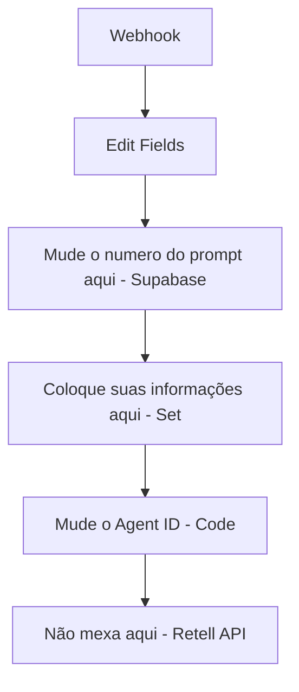

# Workflow: Migração de Chamada Retell AI

## Descrição Geral
Este workflow automatiza o disparo de chamadas de voz via **Retell AI**. Ele inicia recebendo dados via Webhook, busca um prompt específico no banco de dados **Supabase**, realiza o tratamento de texto e formatação de variáveis dinâmicas, e finalmente envia uma requisição para a API da Retell AI para criar a chamada telefônica.

## Flowchart

## Detalhes dos Nós

### 1. Webhook
- **Tipo**: `n8n-nodes-base.webhook`
- **Descrição**: Ponto de entrada do workflow que recebe dados externos via POST.
- **Entradas**: Inicial
- **Saídas**: `Edit Fields`

### 2. Edit Fields
- **Tipo**: `n8n-nodes-base.set`
- **Descrição**: Inicializa variáveis como `numero`, `nome`, `empresa`, `email`, `agent_id`, `Prompt_id` e `data/hora`. Serve para preparar o esquema de dados.
- **Entradas**: `Webhook`
- **Saídas**: `Mude o numero do prompt aqui`

### 3. Mude o numero do prompt aqui
- **Tipo**: `n8n-nodes-base.supabase`
- **Descrição**: Realiza um `GET` na tabela `Prompts` do Supabase para buscar o registro onde `id` é igual a `24`.
- **Entradas**: `Edit Fields`
- **Saídas**: `Coloque suas informações aqui`

### 4. Coloque suas informações aqui
- **Tipo**: `n8n-nodes-base.set`
- **Descrição**: Formata os dados para a ligação, definindo o número de destino e mapeando o texto da ligação (`Ligação/txt`) para o campo `prompt`.
- **Entradas**: `Mude o numero do prompt aqui`
- **Saídas**: `Mude o Agent ID`

### 5. Mude o Agent ID
- **Tipo**: `n8n-nodes-base.code`
- **Descrição**: Executa uma lógica JavaScript para:
  1. Limpar o prompt (remove quebras de linha e caracteres especiais de markdown).
  2. Montar o objeto `body` esperado pela Retell AI, incluindo `from_number`, `to_number`, `override_agent_id` e variáveis dinâmicas (`customer_name`, `now`, `contexto`, etc.).
- **Entradas**: `Coloque suas informações aqui`
- **Saídas**: `Não mexa aqui`

### 6. Não mexa aqui (Retell API)
- **Tipo**: `n8n-nodes-base.httpRequest`
- **Descrição**: Faz um POST para `https://api.retellai.com/v2/create-phone-call` com os cabeçalhos de autorização e o corpo JSON preparado no passo anterior.
- **Entradas**: `Mude o Agent ID`
- **Saídas**: Final do fluxo.
